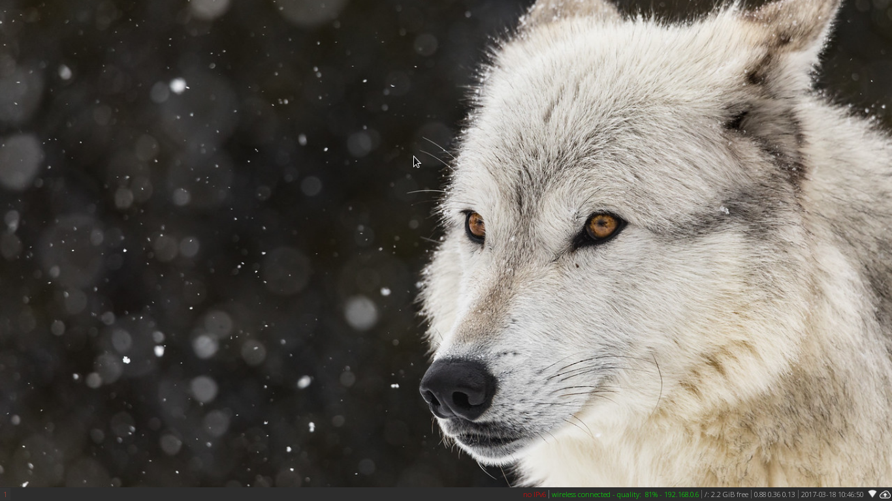
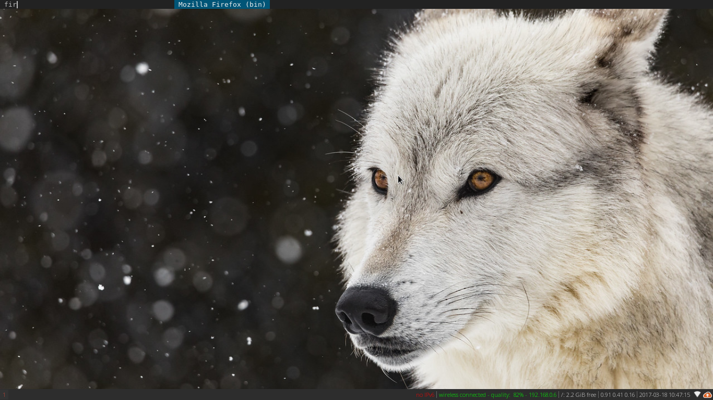
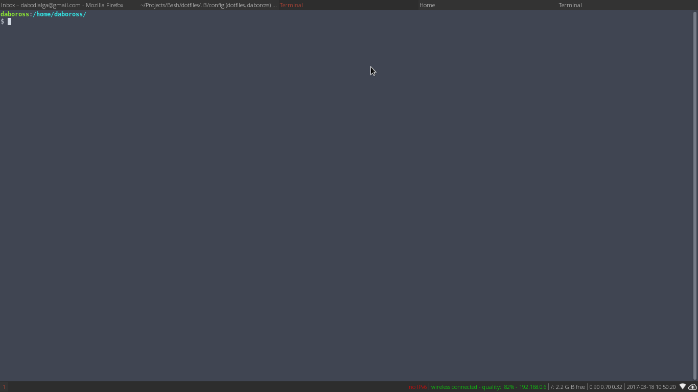
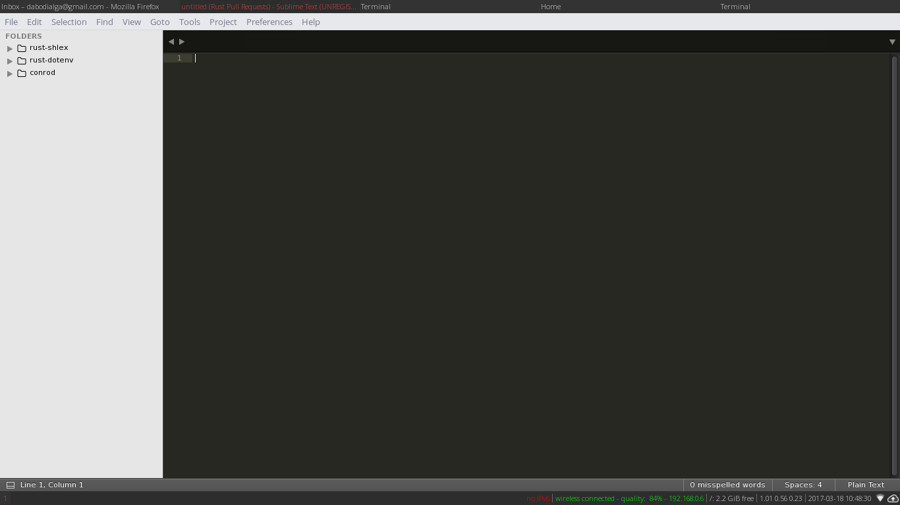
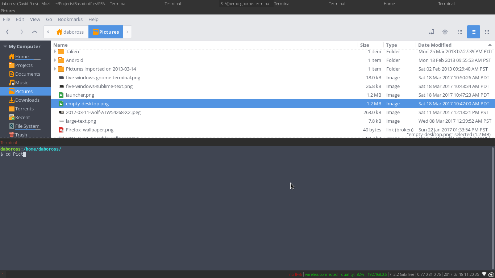
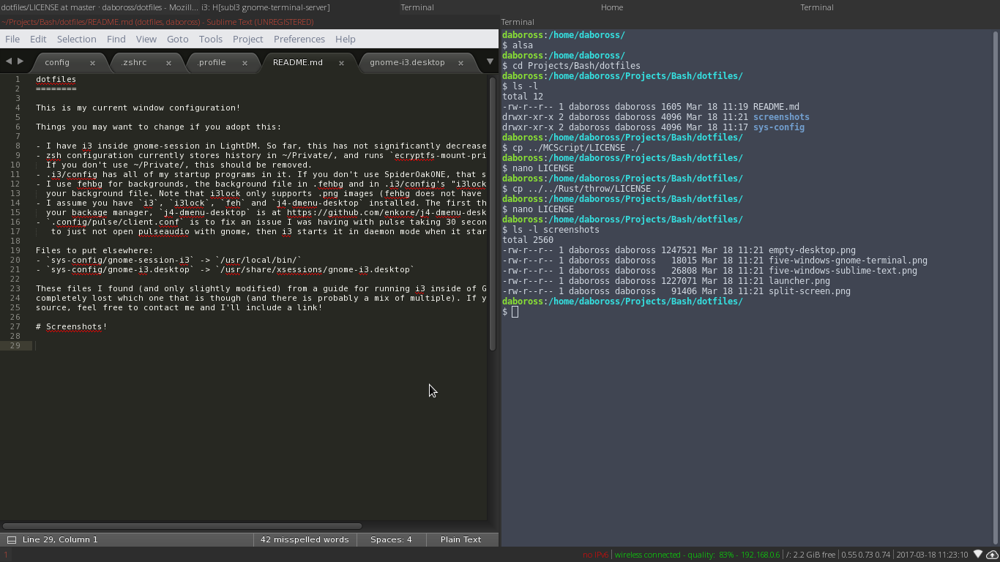

dotfiles
========

This is my current window configuration!

Things you may want to change if you adopt this:

- I have i3 inside gnome-session in LightDM. So far, this has not significantly decreased the speed.
- zsh configuration currently stores history in ~/Private/, and runs `ecryptfs-mount-private` when starting a terminal.
  If you don't use ~/Private/, this should be removed.
- .i3/config has all of my startup programs in it. If you don't use SpiderOakONE, that should be removed from there.
- I use fehbg for backgrounds, the background file in .fehbg and in .i3/config's "i3lock" line should be adjusted to
  your background file. Note that i3lock only supports .png images (fehbg does not have that limitation).
- I assume you have `i3`, `i3lock`, `feh` and `j4-dmenu-desktop` installed. The first three can probably be found in
  your backage manager, `j4-dmenu-desktop` is at https://github.com/enkore/j4-dmenu-desktop.
- `.config/pulse/client.conf` is to fix an issue I was having with pulse taking 30 seconds to login. This config is set
   to just not open pulseaudio with gnome, then i3 starts it in daemon mode when it starts.
- This includes my zsh config just for the heck of it, feel free to only grab window related stuff if you want.

Files to put elsewhere:
- `sys-config/gnome-session-i3` -> `/usr/local/bin/`
- `sys-config/gnome-i3.desktop` -> `/usr/share/xsessions/gnome-i3.desktop`

These files I found (and only slightly modified) from a guide for running i3 inside of Gnome - I seem to have
completely lost which one that is though (and there is probably a mix of multiple). If you find (or are) the original
source, feel free to contact me and I'll include a link!

# Screenshots!

Empty desktop

Launching firefox

Five windows to demonstrate common usage:

Split Screen (actually taken just now when creating this repository!)

n
